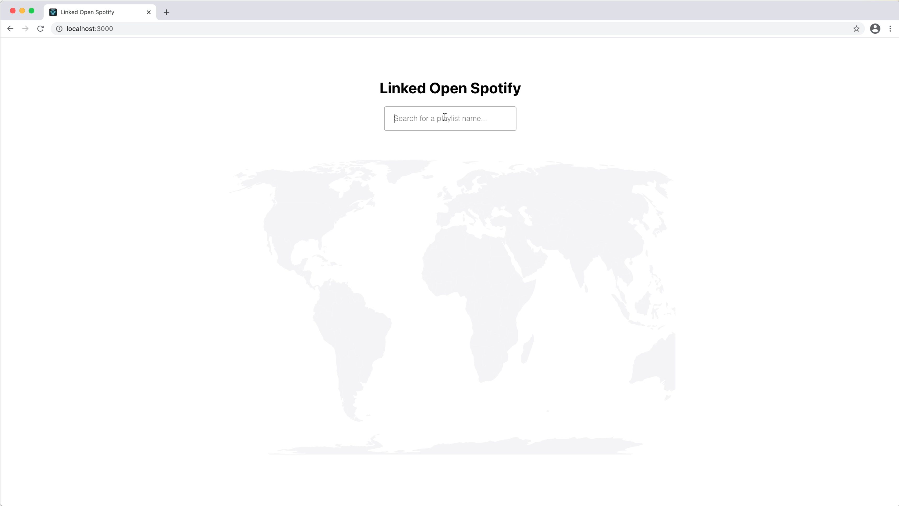

# Final Project Data Science 2020/2021

This repository contains the final project. It consists of two parts:
- A Spring Boot Java REST Api
- A React frontend

## Installation

### Requirements

- Nodejs (>= v14)
- Java (v15)
- Maven

### Setup

1. Install backend dependencies using `mvn install`
2. Install frontend dependencies using `cd frontend && npm install`

### Setting the secret keys for the Spotify API

1. Go to https://developer.spotify.com/dashboard/login and login with your spotify account.
2. Create a new application. Here you can find a clientID and a clientSecret.
3. Go to the config file`/src/main/resources/application.properties`.
4. Update the properties `spotifyClientSecret` and `spotifyClientId` with the corresponding values obtained from the spotify application dashboard.

### Build and run

1. Start the backend [like any other Spring application](https://spring.io/guides/gs/spring-boot/).
2. Start the frontend using `cd frontend && npm run start`

## Core of the Code

The two most interesting classes are the services that interact with the Spotify API and the Wikidata endpoint. 

These classes can be found here:

`BACK_END = master/src/main/java/com/group135/final_project/`

`BACK_END/services/{LODService.java, WikidataIdResolver.java, SpotifyService.java}`

Moreover, these services are used by the main controller, `BACK_END/http/controllers/MainController.java` which then combines the data using a data class, `BACK_END/model/EnhancedArtist.java`, which is then sent to the frontend for visualisation.
